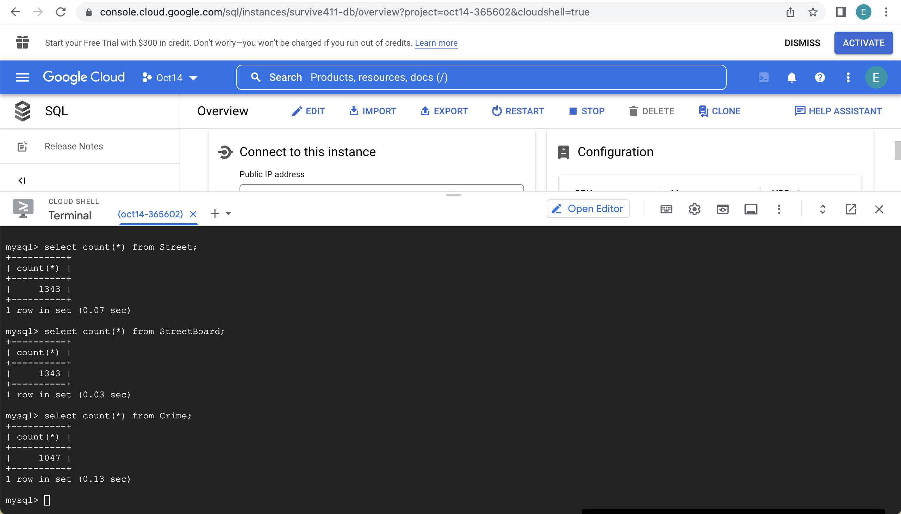

# Database Design
## Implementing the Database Table on GCP

## Data Definition Language (DDL)
### Street
```sql
    CREATE TABLE Street (
        County VARCHAR(45) NOT NULL,
        Frequency FLOAT NOT NULL,
        Name VARCHAR(45) NOT NULL,
        NumCrime INT NOT NULL,
        StreetID INT NOT NULL,
        Trend FLOAT NOT NULL,
        ZipCode INT NOT NULL,
        PRIMARY KEY (StreetID)
    );
```
### StreetBoard
```sql
    CREATE TABLE StreetBoard (
        Content VARCHAR(10000) DEFAULT NULL,
        StreetID INT NOT NULL,
        BoardID INT NOT NULL,
        PRIMARY KEY (BoardID),
        FOREIGN KEY (StreetID)
            REFERENCES Street(StreetID)
            ON DELETE SET NULL
            ON UPDATE CASCADE 
    );
```
### User
```sql
    CREATE TABLE User (
        ID INT NOT NULL,
        Name VARCHAR(45) DEFAULT NULL,
        SEX VARCHAR(45) DEFAULT NULL,
        Password INT NOT NULL,
        PRIMARY KEY (ID)
    );
```
### Crime
```sql
    CREATE TABLE Crime (
        CrimeID INT NOT NULL,
        Address VARCHAR(300) DEFAULT NULL,
        CrimeType VARCHAR(45) NOT NULL,
        ByUser TINYINT(1) NOT NULL,
        CrimeTime DATETIME NOT NULL,
        Description VARCHAR(200) NOT NULL,
        PRIMARY KEY (CrimeID),
        FOREIGN KEY (StreetID) REFERENCES Street(StreetID) 
    );
```
### SafetyLevel
```sql
    CREATE TABLE SafetyLevel (
        LEVEL INT NOT NULL,
        MinDanger DOUBLE NOT NULL,
        MaxDanger DOUBLE NOT NULL,
        PRIMARY KEY (LEVEL)
    );
```

### Trigger
```sql
delimiter //
use Crime_Map //
CREATE TRIGGER InsertCrimeTrig
    before INSERT ON Crime_Map.Crime
        FOR EACH ROW
    BEGIN

        -- SET NumCrime
        UPDATE Crime_Map.Street
        SET NumCrime = NumCrime + 1
        WHERE Crime_Map.Street.StreetID = New.StreetID;
		-- set CrimeID
        set new.CrimeID = (select max(CrimeID) from Crime_Map.Crime) + 1;
    END //

delimiter ;


delimiter //
use Crime_Map //
CREATE TRIGGER ChangeFreq
    after INSERT ON Crime_Map.Crime
        FOR EACH ROW
    BEGIN
        -- SET frequency = frequenceyCrime
        UPDATE Crime_Map.Street
        SET Frequency =  (
            SELECT COUNT(CrimeID)
            FROM Crime_Map.Crime c 
            WHERE StreetID = New.StreetID AND DATEDIFF(CurTime(),c.CrimeTime) < 30
        )
        WHERE Crime_Map.Street.StreetID = New.StreetID;
    
    END //

delimiter ;
```
## Inserting at least 1000 Rows

## Advance Query

```sql
	SELECT CrimeID, CrimeType, CrimeTime, Address, Description
	FROM Crime_Map.Crime NATURAL JOIN Crime_Map.Street
	WHERE CrimeType = 'Theft' AND Name = 'East Green Street'
	UNION
	SELECT CrimeID, CrimeType, CrimeTime, Address, Description
	FROM Crime_Map.Crime NATURAL JOIN Crime_Map.Street
	WHERE CrimeType = 'Theft' AND Name = 'East Springfield Avenue'
```


```sql
    select Name, level, levelnum.num
    from Crime_Map.Street s join Crime_Map.SafetyLevel l 
    on (s.Frequency >= l.MinDanger and s.Frequency <= l.MaxDanger) 
    natural join    (select level,count(s.StreetID) as num
                    from Crime_Map.Street s right join Crime_Map.SafetyLevel l 
                    on (s.Frequency >= l.MinDanger and s.Frequency <= l.MaxDanger)
                    group by Level
                    order by Level ) as levelnum
    order by level desc
```


## Indexing 

#### For query 1

```sql
EXPLAIN ANALYZE 
	SELECT CrimeID, CrimeType, CrimeTime, Address, Description
	FROM Crime_Map.Crime NATURAL JOIN Crime_Map.Street
	WHERE CrimeType = 'Theft' AND Name = 'East Green Street'
	UNION
	SELECT CrimeID, CrimeType, CrimeTime, Address, Description
	FROM Crime_Map.Crime NATURAL JOIN Crime_Map.Street
	WHERE CrimeType = 'Theft' AND Name = 'East Springfield Avenue'
	
```


Firstly, we analyzed the 1st query without index. The filter part cost a lot. 

```sql
CREATE INDEX index_crimetime ON Crime_Map.Crime (CrimeTime)
```


Next, we added an index on CrimeTime attribute but we found that the cost and time didn't change a lot. Because we wanted to see if the index has no relation to our filter condition, will the performance be improved by using this index. Unfortunately, this kind of index is useless.

```sql
CREATE INDEX index_crimetype ON Crime_Map.Crime (CrimeType)
```


Then, we added an index on CrimeType attribute which is an attribute in our filter condition. We added this index because this attribute is related to our filter and index can make find record with the search key quicker. This time, the performance improved a lot.

```sql
CREATE INDEX index_streetname ON Crime_Map.Street (Name)
```


Finally, we added one more index on Street's Name which is also an attribute in our filter condition. The reason is the same as above, because this attribute is related to our filter and index can make find record with the search key quicker. Our query's speed also became faster. And the cost of filter decreased a lot from 44.05 to 0.97.

------

#### For query 2
```sql
explain analyze
    select Name, level, Frequency, levelnum.num
	from Crime_Map.Street s join Crime_Map.SafetyLevel l 
    on (s.Frequency >= l.MinDanger and s.Frequency <= l.MaxDanger) 
	natural join (select level,count(s.StreetID) as num
	from Crime_Map.Street s right join Crime_Map.SafetyLevel l 
    on (s.Frequency >= l.MinDanger and s.Frequency <= l.MaxDanger)
	group by Level) as levelnum
    where Frequency >= 1
	order by level desc
```
First, we experiment without index, the filter (where) part also cost a lot.


Next, we add index on MinDanger on table SafetyLevel, because MinDanger appears in join and filter. We can find all the analytic data is nearly the same as the experiment without index. We believe this is because the number of MinDanger is too small in the table SafetyLevel, so index cannot improve the speed of filter and join.

```sql
create index index_MinDanger on Crime_Map.SafetyLevel (MinDanger)
```


Then, to prove our hypothesis is correct, we add index on MaxDanger on table SafetyLevel. We find that the experiment result is also the same as the experiment without index, which prove our hypothesis is correct.

```sql
create index index_MaxDanger on Crime_Map.SafetyLevel (MaxDanger)
```


Finally, we add index on Frequency on table Street, because Frequency also plays a role in join and filter, and the number of Frequency is huge. We find out that the cost of filter decrease from 107.04 to 50.87. This is because the number of frequency in Street is large, so adding index to this column can speed up the query.

```sql
create index index_freq on Crime_Map.Street (Frequency);
```


#### Fun Fact

When running query2, we find that sometimes running the same query 2 times we can get different running time, shown as below. We suppose it's because sometimes sql will store cache in memory and if we run an experiment many times sql can speed up calculation by storing the cache.


------

#### Conclusion

From our experiments, we think that the key to improve query performance is making index related to attributes in filter or any condition in the query. On the other hand, if the index is related to some attributes that are not used in searching, condition or filter, the index won't improve the query performance very much.
