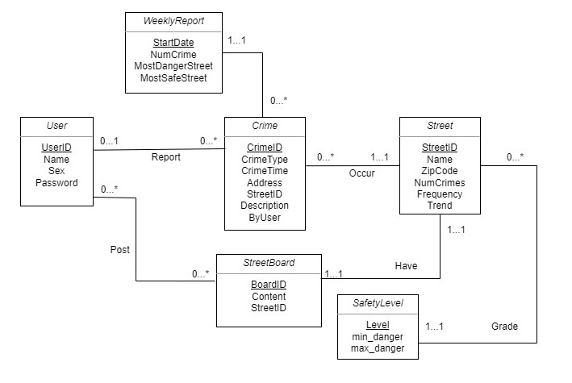

## Relationship Description
1. **User**: Contain user information including UserID, Name, sex, password.  UseID is assigned by our system. For user convenience, name and sex are optional so they sometimes are NULL in table. Cardinality: X 

2. **Crime**: Contain crime information for each criminal case, including CrimeID, CrimeTime, Address, StreetID, Description,
    ByUser Crime type.  CrimeID is assigned by our system. ByUser is a BOOLEAN, which shows whether this crime record is reported by user or police office. If this record is reported by user, we will remove it one day later. Different crime type has different risk. The risk will be used to calculate trend for street. Cardinality: X

3. **Street**: Contain Street information, such as StreetID, Name, ZipCode, NumCrimes, Frequency, Trend. The StreetID is assigned by our system and ZipCode+Name are used to identify location on GoogleMap. Besides, Frequency is related to one month and Trend is related to one week. Trend is not a calculated frequency, instead, we will design a way to make it show The rate of change in crime.    Cardinality: X

4. **StreetBoard**: Street board is a board that every user can write comment on it. They can write anything concerning about the crime information of the street on the board and everyone can view the comment on the board. It contains BoardId, StreetID, Content, Users.   Cardinality: X

5. **SafetyLevel**: it contains the level (chosen from 1, 2, 3, 4, 5) and minimal danger number and maximum danger number for that street. This level depends on a criterion called danger number which will be calculated from a street's #crimes, frequency, trend.  The number Cardinality: X

6. **WeeklyReport**: contains weekly crime information such as most dangerous street, least dangerous street, etc.   Cardinality: X

   

## Assumption
1. StreetID in Crime table must be in StreetID in street
2. User can report many Crime, a crime can only be reported by one user
3. A crime can only happen in one Street, a Street can contain many crimes
4. A user can write on many StreetBoards, a StreetBoard can be written by many users
5. A Street Board belongs to only one Street, a Street can only have one streetBoard
6. StreetID in street board must be in the StreetID in the Street
7. A Street can have only one safety level, many street can share the same safety level
8. A Weekly report may be related to many crimes but a crime can only belong to one weekly report.

## Schema

**Entity Set Table:**

```User(UserID: INT [PK], Name: VARCHAR(255), Sex: VARCHAR(5), Password: VARCHAR(255))

WeeklyReport(StartDate: Date [PK], NumCrime: INT, MostDangerStreet: VARCHAR(50) [Attribute Level Constraint to Street.Name] , MostSafeStreet: VARCHAR(50) [Attribute Level Constraint to Street.Name])

Crime(CrimeID: INT [PK], CrimeType: VARCHAR(50), CrimeTime: Time, Address: VARCHAR(70), StreetID: INT [FK to Street.StreetID], Description: VARCHAR(255), ByUser: BOOLEAN)

SafetyLevel(Level: INT [PK], min_danger: REAL, max_danger: REAL )

StreetBoard(BoardID: INT [PK], Content: VARCHAR(500), StreetID: INT [FK to Street.StreetID])

Street(StreetID: INT [PK], Name: VARCHAR(30), ZipCode: INT, NumCrimes: INT, Frequency: REAL, Trend: REAL)
```


**Relation Table:**

*NO NEED TO IMPLEMENT Have and WeeklyReport and Crime relation*

For weekly report, we will update it once a week. Although it can have relation table with others, for saving computation resources and storage, we just update it once a week instead of saving relation into a new table. To illustrate more clearly, weekly report's data is from Crime table but we won't build a table saving the relation between them in order to save resources.

Report(UserID,  CrimeID[PK])

Post(  (UserID,BoardID) [PK] )

Grade( StreetID [PK], Level )

Occur( CrimeID [PK], StreetID)

Have( (BoardID, StreeID)[PK] )
