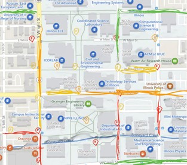
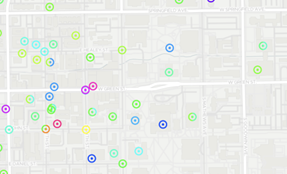

# **STUI: Survive and Thrive in UIUC**

## Project Summary
We want to create a web application that can clearly display the crime. Users can use the website to report incidents they have seen as well as locate areas with high crime rates. With the use of this website, we want to reduce crime and improve student safety at UIUC.

## Project Description
Since the `crime rate` of Champaign and Urbana is almost the highest in Illinois, and `UIUC students` are the main victims, we decide to develop a web application that can help students and faculty to query and report crime in a map. In the map, Users can intuitively see `what`, `when`, `where` the crime happens in UIUC. 

Based on the `data and artificial intelligence`, the web can also predict where crime is most likely to occur, so that it can tell the police to raise the level of vigilance in that area, and also helps the public to avoid that area as much as possible. We hope both UIUC students and policemen can not only `survive` but also `thrive` in Champaign and Urbana.

## Realness
Our data will be the records of crime within UIUC campus and surrounding areas such as Champaign, Urbana, and Savoy. The best way for us to get our data is from police stations around those areas. That could only happen if they give us access to their database. If not, we might need to do some crawling from local newspapers. We hope to format our data to a table with attributes such as CrimeId, Date, Address, TypeOfCrime, and so on. 

## Usefulnesss

​    Our program aims to build a map for students and faculties in UIUC to check crimes around and on campus. Our project will help people avoid meeting crime and have a safer campus life. This is useful especially for those who like going home late at night.

​    We find a similar website https://police.illinois.edu/info/map which has very similar function as ours. Our project will do similar UI display on map and show user all information of crime. But we will add some new features like **providing user a way to log crime themselves or log some possible crimes** though they may not happen at last. Besides, we will add a feature that we can **see a criterion called ‘safe level’ for every street**. The safer it is, the greener it will be on the map. In our system, user can also **select the information they want to see by themselves**. We will provide UI and let them select information easily through clicking their mouse.

## Description of the functionality
### Data stored in the database
1. Daily Crime Log https://police.illinois.edu/info/daily-crime-log/ provides data of crimes reported in the university area during the last 60 days. Illini Alerts sent by police in campus is also a source of data for our website. Data of crimes can be stored with following attributes:
* Crime code
* Reported time
* Occurred time
* General location
* Crime description
* Disposition
2. Individual reporters are stored in a table, with attributes as follows:
* Name(Optional)
* User Id
* Reported crime codes
3. The safety degree of each street formed by data in Crime table, with attributes as follows:
* Street name
* Street location
* Safety level
* Number of crimes
* Trend of crime number
* Dangerous time slots
### Basic functions of our website
1. A crime map visualizing crime data
* Users can have a view of the safety level directly from color indication. (complex feature, UI related) 
* A time-based version of the map, in which safety level will be calculated base on crimes in different time slots of a day. (simple feature, view of database)
* Users are able to select the types of crimes they want to be displayed on the map. (simple feature, view of database)
2. A report system
* Users can upload crimes they witnessed around the campus. (simple feature, insertion in database)
* If there're multiple reports of a single crime, the system shall be able to identify and ask the user if they're the same. (complex feature, similarity detection)
### Good creative component
1. Display of emergency devices
* Users can view where can they find emergency devices on the map.

## A low fidelity UI mockup

​    Our UI will include a map and **each crime will be a mark on the map**. The mark’s color will depend on the information of crime and be set by the system. Besides, every street will have **a color to indicate how safe it is**. User can select to filter some of the crime and they can also close the ‘safe level’ to see the map clearer.

​    Beside map UI, we also provide **a simpler UI which for user who wants only to see information of the crimes**. They can use table view and export table in excel or csv form into their own computer.

## Project work distribution:

​    UI part:    

- Elijah -- fundamental implement, mainly about web and button
- Erkai -- check how to add a map and sign something on it
- Zicheng – polish UI and split map and table part
- Zhirong -- responsible for table part’s UI

​    Database part:

-  Elijah and Erkai: Check online database and some API to fetch data
-  Zhirong and Zicheng: Backend query implement and connect them with user level input
